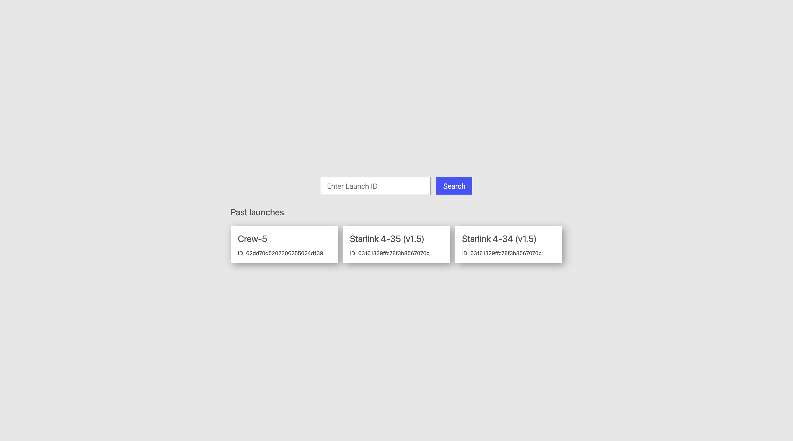
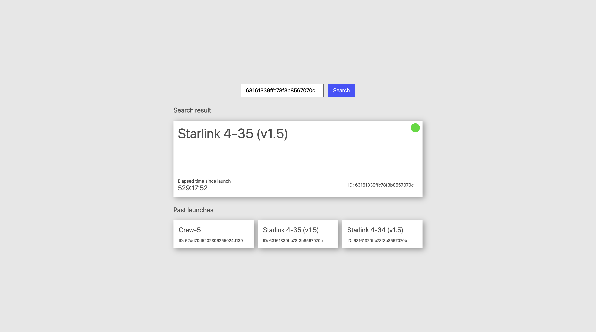
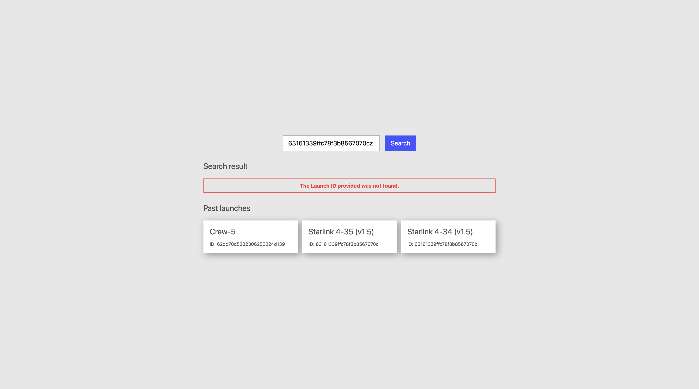
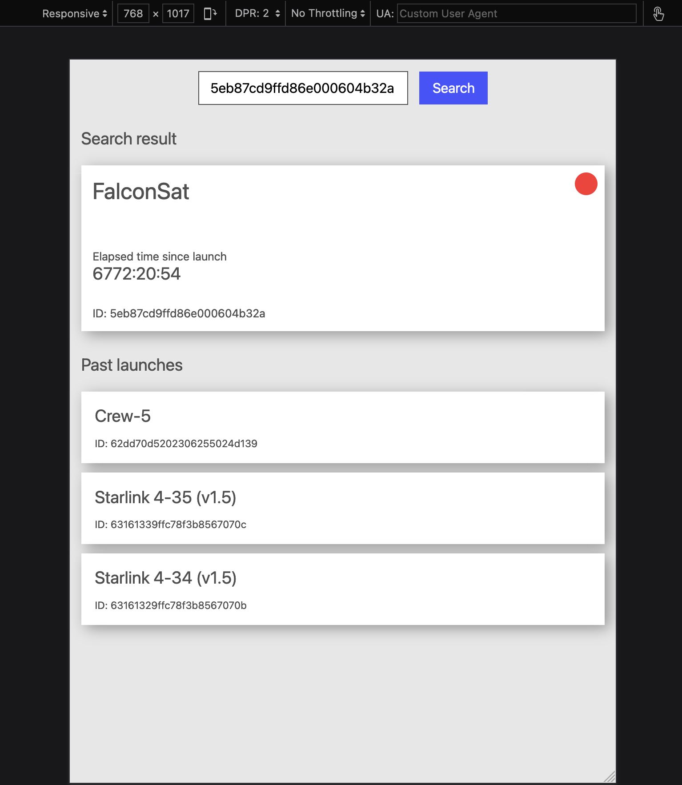
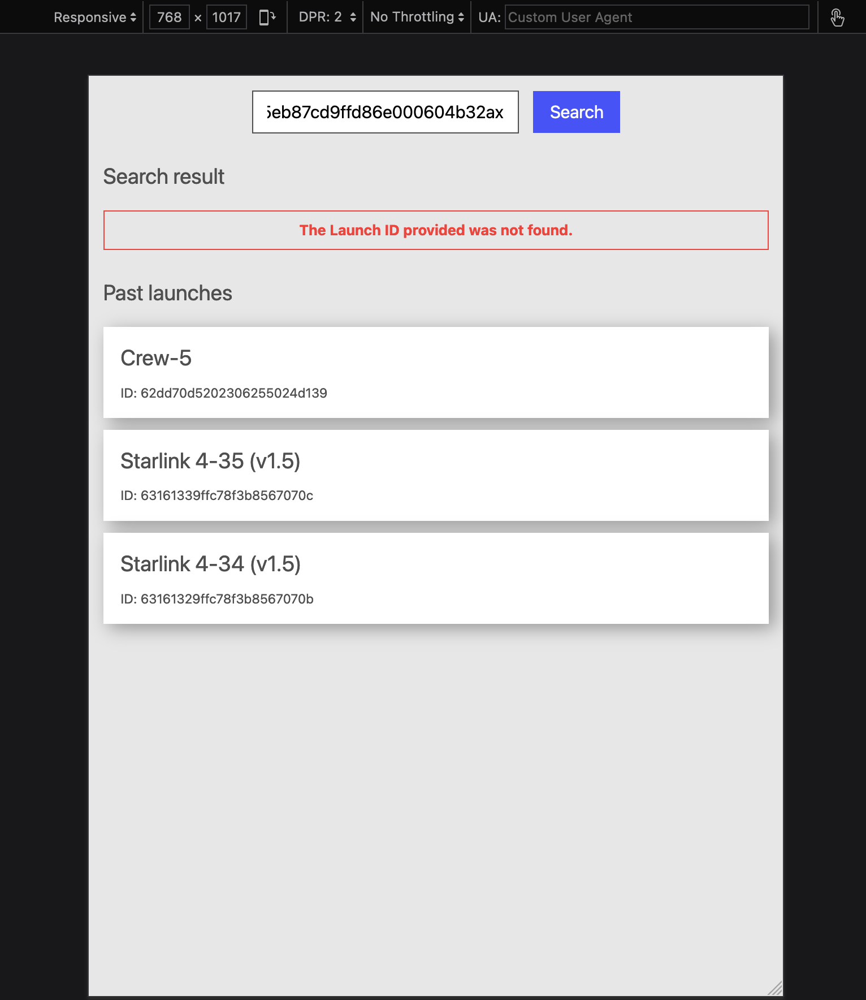
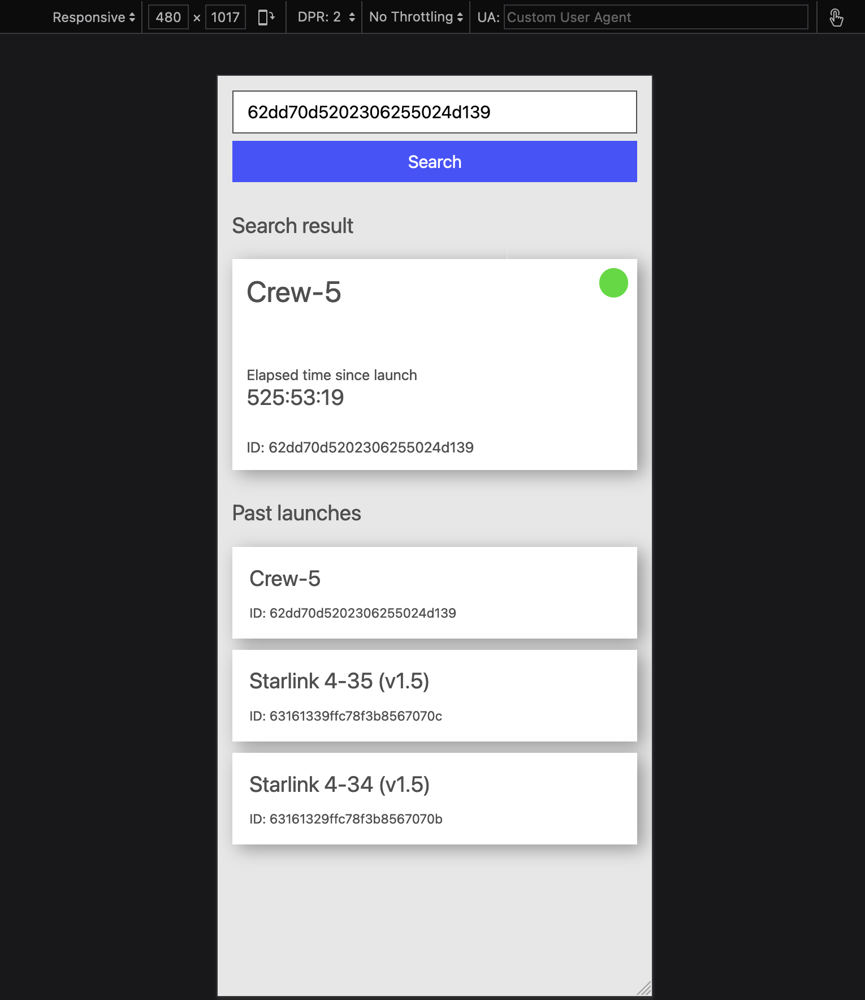
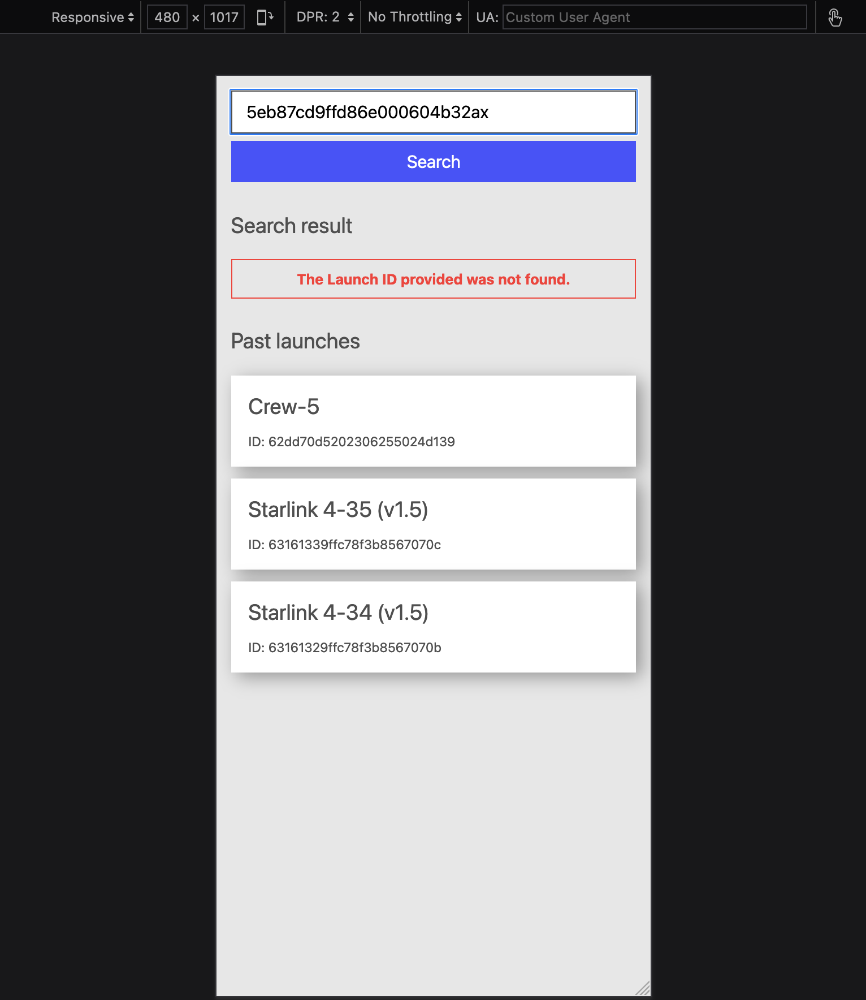

# Modern Frontend React Application Architecture

Modern Frontend React Application Architecture using SpaceX's Rocket Launches API

This project demonstrates:

- decent React application configuration using Vite
- Typescript for static analysis
- CSS modules
- ESLint for the enforcement of best practices
- Unit testing with React testing library
- End-to-end testing with Cypress
- Custom error boundary
- Component library (Atomic Design) using Storybook
- Web Accessibility for assistive technologies (e.g. screen reader) and keyboard navigation

## **Final UI Design - Desktop**

## **Final UI Design - Medium**

## **Final UI Design - Small**

  

## Run App in Development Mode

### Install NPM Modules

- Run **yarn install**

### Start dev server

- Run **yarn dev**
    

## Storybook Component Library

### Run Storybook

- Run **yarn storybook**
    

## Run Tests

### Linting

- Run **yarn lint**

### Unit Tests

- Run **yarn test**

### E2E Tests

- Run **yarn test:e2e**
    

## Dev Environment

This project was developed in VS Code IDE with Vite, Vitest, ESLint and Prettier pluggins
  

## To Dos (applicable in production apps only)

- Translations
- Version Control System (VCS)
- Automated UI Regression Tessting (e.g. Chromatic)
- CI/CD
- Analytics
- Error Logging & Monitoring etc
